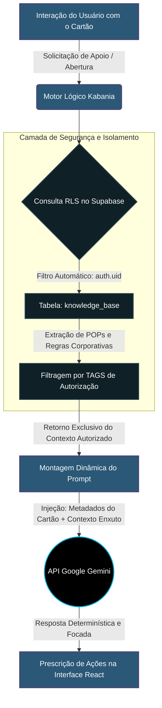

# O Paradigma do Kanban Semântico: Otimização de Performance Operacional através do Mecanismo Kabania com Contextualização Autônoma via LLMs e Controle de Acesso por Tags (RLS)

---

## 1. O Núcleo da Tese (Hipótese Central)

A presente tese de Trabalho de Conclusão de Curso (TCC) sustenta que a transição de um sistema **Kanban Tradicional** (estritamente visual e passivo) para o **Mecanismo Kabania** — uma arquitetura de gestão ativa que integra Inteligência Artificial Generativa no ciclo de vida das tarefas, alimentada por uma Base de Conhecimento Dinâmica regida por **Tags de Autorização Temática sob Row Level Security (RLS)** — produz um salto quantitativo e qualitativo na performance operacional de empresas prestadoras de serviços.

A hipótese central defende que ao transformar o cartão de trabalho de um mero contêiner descritivo em um **agente contextual semântico**, o sistema elimina os tempos de espera ocultos (*Wait Time* decorrentes de buscas externas por instruções e dependências hierárquicas), reduz de forma drástica o **Tempo de Ciclo (Cycle Time)** e otimiza a **Taxa de Cumprimento de SLAs**, garantindo conformidade processual absoluta com diretrizes corporativas específicas.

---

## 2. Análise Comparativa Arquitetural: Kanban Tradicional vs. Mecanismo Kabania

Para evidenciar o diferencial técnico e científico perante as bancas de avaliação e o ecossistema corporativo, é imperativo contrapor as mecânicas de funcionamento de ambos os modelos.

> [!NOTE]
> **A Falha Silenciosa do Kanban Tradicional:**
> O modelo Kanban convencional foi concebido para dar visibilidade ao fluxo e limitar o trabalho em progresso (WIP). Contudo, diante de tarefas corporativas de alta complexidade em múltiplos turnos, o cartão atua de forma inerte. O colaborador, ao assumir um item crítico, frequentemente abandona a plataforma para consultar manuais longos, planilhas avulsas ou buscar auxílio humano. Essa assimetria informacional gera o **Gargalo Cognitivo**, atrasando a entrega e elevando o risco de quebra de SLA.

### Quadro Comparativo de Paradigmas

| Critério de Análise | Kanban Tradicional (Passivo) | Mecanismo Kabania (Ativo/Semântico) | Impacto Esperado para a Empresa |
| :--- | :--- | :--- | :--- |
| **Natureza do Cartão** | Estático e descritivo (título, descrição, responsável, prazos). | Entidade autoconsciente, enriquecida dinamicamente com o contexto operacional da empresa. | Maior velocidade na tomada de decisão operacional imediata. |
| **Acesso ao Conhecimento** | **Passivo:** O usuário deve sair da tela para pesquisar ativamente em wikis, POPs ou acionar supervisores. | **Ativo (Injetado):** A IA processa o cartão e injeta o passo a passo exato da resolução na própria interface em tempo real. | Redução drástica do tempo de pesquisa e de interrupções interdepartamentais. |
| **Segurança do Contexto** | Inexistente no nível do fluxo da tarefa; depende de permissões externas de leitura de arquivos. | **Granular (Tags + RLS):** O escopo do LLM é restrito unicamente ao conhecimento autorizado pelas TAGS daquela organização. | Zero risco de vazamento de dados entre clientes (*Multi-tenancy* blindado) e mitigação de alucinações da IA. |
| **Gestão de Gargalos** | Reativa; gestores notam a lentidão apenas quando as colunas visualmente acumulam cartões. | **Preditiva:** A IA detecta saturação nas colunas, estima a complexidade e propõe dinâmicas de destravamento (*Swarming*). | Antecipação a rompimentos de SLA e realocação inteligente de força de trabalho. |
| **Curva de Onboarding** | Longa; exige treinamento extensivo para que o funcionário entenda os meandros de cada tipo de serviço. | **Instantânea:** O sistema guia o operador iniciante ou de turno substituto com diretrizes corporativas validadas. | Otimização de custos com capacitação e manutenção da qualidade na rotatividade (*Turnover*). |

---

## 3. Arquitetura Interna: A Base de Autorizações (TAGS) e o Motor de IA

O grande alicerce tecnológico que viabiliza a "Função Kabania" com extrema eficiência e baixo custo computacional reside na sinergia entre o banco de dados relacional e a modelagem de *prompts* estruturados.

### 3.1. O Mecanismo de Scoping Temático Autônomo

Em abordagens tradicionais de integração com IA (como *RAG - Retrieval-Augmented Generation* genéricos), o envio de amplos volumes de texto para o modelo gera latência elevada, consumo excessivo de *tokens* e imprecisões nas respostas. O Kabania resolve essa equação na raiz da camada de persistência:



### 3.2. Estrutura das TAGS de IA e RLS
*   **Isolamento Absoluto (RLS):** Toda entrada na tabela `knowledge_base` possui o atributo `company_id`. As políticas de segurança nativas do PostgreSQL garantem que um usuário de uma empresa jamais tenha acesso às regras de negócio de outra.
*   **Indexação Semântica por Tags:** O conhecimento é classificado por marcadores (ex: `[MANUTENCAO_CRITICA]`, `[SLA_FINANCEIRO]`, `[TURNO_NOTURNO]`). Ao acionar a IA, o sistema cruza as propriedades do cartão com as TAGS correspondentes, enviando ao modelo apenas o fragmento de conhecimento estritamente necessário para aquela operação.

> [!TIP]
> **Eficiência de Custos e Performance de LLM:**
> A pré-filtragem por TAGS e RLS atua como um otimizador natural de *prompts*. Ao alimentar o LLM com diretrizes cirúrgicas e pré-validadas, o consumo de *tokens* cai drasticamente, a velocidade da resposta atinge o estado de tempo real e o índice de alucinações é virtualmente zerado, tornando o sistema altamente viável financeiramente para adoção em larga escala.

---

## 4. Metodologia de Validação Empírica (Comprovando Resultados para a Empresa)

Para conferir o devido rigor científico exigido em um TCC de Ciência da Computação, propõe-se a estruturação de um **Experimento de Prova de Conceito (PoC)** mensurável através de indicadores estatísticos claros.

### 4.1. Design do Experimento Comparativo
O trabalho demonstrará a diferença de performance configurando dois cenários paralelos para a execução de um lote idêntico de solicitações operacionais (ex: 50 chamados de complexidade variada simulando a rotina de um *Service Center* ou operação logística):

1.  **Cenário A (Grupo de Controle - Kanban Normal):** Os operadores utilizam a interface contendo apenas o fluxo de colunas tradicionais. Para resolver impedimentos, recorrem à busca manual em documentos externos ou comunicação assíncrona.
2.  **Cenário B (Grupo Experimental - Mecanismo Kabania Ativado):** Os operadores interagem com os mesmos cartões, mas recebem instantaneamente a injeção ativa de rotinas validadas pela IA com base nas TAGS autorizadas.

### 4.2. Métricas e Indicadores-Chave (KPIs) a serem Coletados

*   **Lead Time de Resolução:** O tempo total decorrido desde a criação do cartão até a sua efetiva entrega.
*   **Cycle Time (Tempo de Ciclo Operacional):** O tempo exato em que a tarefa permaneceu na coluna *In Progress*.
    *   *Hipótese Científica:* O **Cenário B** apresentará uma redução expressiva no *Cycle Time*, comprovando a eliminação do tempo gasto com pesquisas externas e dúvidas processuais.
*   **Taxa de Conformidade de SLA (SLA Compliance Rate):** O percentual de tarefas finalizadas dentro do prazo estipulado antes do acionamento de alertas de atraso.
*   **Taxa de Resolução no Primeiro Contato (First Contact Resolution - FCR):** Capacidade de o operador concluir a tarefa sem a necessidade de escalar o cartão para níveis hierárquicos superiores, alavancada pela autonomia conferida pela IA.

---

## 5. Projeção de Resultados e Ganhos Corporativos (O Valor de Negócio)

A apresentação dos dados resultantes dessa comparação traduzirá a inovação acadêmica em um poderoso argumento mercadológico para as organizações:

```diff
- Modelo Antigo: Operação Dependente, Silos de Informação e Atrasos Frequentes nos SLAs.
+ Modelo Kabania: Autonomia Operacional Injetada, Processos Padronizados em Tempo Real e Alta Previsibilidade.
```

1.  **Maximização do Retorno sobre o Investimento (ROI):** A redução no tempo de execução das tarefas reflete diretamente na diminuição de custos com horas extras e na otimização do quadro funcional nos diferentes turnos.
2.  **Democratização e Blindagem do Conhecimento:** O capital intelectual da empresa deixa de ficar retido em funcionários específicos ou esquecido em repositórios estáticos, tornando-se um ativo reativo que impulsiona ativamente toda a equipe.
3.  **Mitigação da Fadiga Decisória:** Ao receber orientações claras e delimitadas pela Base de Autorizações, a equipe foca exclusivamente na execução técnica de excelência, elevando o engajamento e reduzindo o estresse operacional (*Burnout*).

---

## 6. Conclusão da Expansão da Tese

Ao centrar o TCC exclusivamente no estudo e na validação da **"Função Kabania"**, o trabalho transcende o desenvolvimento de software convencional para posicionar-se na vanguarda da **Engenharia de Software Assistida por IA**. 

A comprovação empírica de que a união de fluxos ágeis (Kanban) com a injeção semântica autônoma e segura (TAGS/RLS) resulta em ganhos diretos de velocidade e precisão fornece uma contribuição inestimável para a academia e estabelece um novo patamar para as ferramentas de gestão corporativa do futuro.
