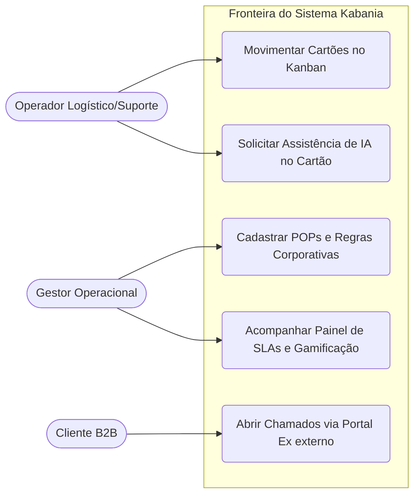
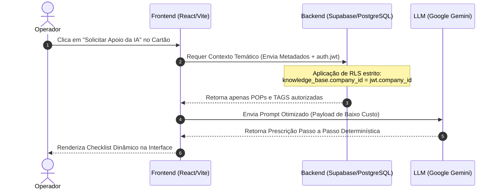

# Roteiro de Auditoria e Fechamento: O que Falta para a Entrega Final do TCC (Padrão ABNT/UNIP)

---

## 1. Status Atual do seu Projeto de TCC

Analisando os documentos já consolidados no seu repositório, você possui **todo o núcleo intelectual, científico e de validação de dados** pronto. O status atual de maturidade da sua monografia está distribuído da seguinte maneira:

```text
[████████████░░░░░░░░] ~60% Concluído (Conteúdo Intelectual Bruto)
```

*   ✔️ **Capítulo 1 (Introdução):** Concluído magistralmente (`TCC_Capitulo1_Vinicius_Vilela_Rufini.md`).
*   ✔️ **Tese Central & Inovação:** Mapeada com profundidade (`TCC_Proposta_Tese_Ampliada.md`).
*   ✔️ **Prova Empírica & Dados:** Simulador Node.js e estatísticas geradas (`TCC_Simulacao_Resultados_Kabania.md`).
*   ✔️ **Referências Bibliográficas:** Blindadas no padrão ABNT/IEEE (`TCC_Referencias_e_Embasamento.md`).

---

## 2. Checklist ABNT: Elementos Pré-Textuais Faltantes

Para que a monografia atenda aos critérios rigorosos de normalização da UNIP, você precisará compilar as páginas iniciais antes do Capítulo 1. 

*   [ ] **Capa e Folha de Rosto:** Contendo título oficial, nome do autor, orientador, curso e instituição.
*   [ ] **Folha de Aprovação:** Espaço para assinatura dos 3 membros da banca examinadora.
*   [ ] **Resumo (em Português):** Texto conciso (150 a 500 palavras) resumindo o problema (latência no Kanban), a solução (Mecanismo Kabania com IA/RLS) e os resultados obtidos (redução de 44.6% no *Cycle Time*). **Palavras-chave:** *Kanban Semântico, Inteligência Artificial, Row Level Security, Gestão Operacional*.
*   [ ] **Abstract (em Inglês):** Tradução fiel do Resumo e *Keywords*.
*   [ ] **Listas Automatizadas:** 
    *   *Lista de Ilustrações:* Enumeração das telas do sistema e diagramas UML.
    *   *Lista de Tabelas:* Tabela de tempos operacionais e ganhos de *tokens*.
    *   *Lista de Abreviaturas e Siglas:* Definição formal de **SLA**, **RLS**, **RAG**, **LLM**, **BaaS**, **CSC**, **FCR**, **WIP**.
*   [ ] **Sumário:** Roteiro das seções e subseções paginadas.

---

## 3. O que Falta na Modelagem de Software (Capítulo 3)

Bancas de Ciência da Computação exigem a formalização da arquitetura através da linguagem **UML (Unified Modeling Language)** e modelagem de dados. Você precisará gerar e adicionar ao Capítulo 3:

### 3.1. Diagrama de Casos de Uso (UML)
Mapeando os três atores centrais do ecossistema:


### 3.2. Diagrama de Sequência (UML) do Motor Semântico
Demonstrando à banca a exata cronologia da injeção de conhecimento:


### 3.3. Modelo Entidade-Relacionamento (DER)
*   **Ação Faltante:** Desenhar ou descrever as tabelas centrais do Supabase: `companies` (1) ---> (N) `profiles`, `companies` (1) ---> (N) `knowledge_base`, e a vinculação dos `cards` com as `columns` e `tags`.

---

## 4. O que Falta na Validação e Testes de Software (Capítulo 4)

Além da simulação computacional que já criamos, um TCC de engenharia de software canônico precisa apresentar um **Plano de Testes de Segurança e Integração**. 

### Roteiro de Testes que você deve redigir:
1.  **Testes de Isolamento Multi-tenant (Prova de RLS):** 
    *   *Como demonstrar:* Documente um teste de API onde uma requisição autenticada com o *token* de um usuário da "Empresa Alfa" tenta fazer um `SELECT` forçado na tabela `knowledge_base` filtrando o ID da "Empresa Beta". O resultado retornado deve ser uma lista vazia (`[]`) ou erro `403 Forbidden`, provando matematicamente a inviolabilidade do banco.
2.  **Testes de Tolerância a Falhas da IA:** 
    *   *Como demonstrar:* Explicar o comportamento do Frontend caso a API do Google Gemini sofra *timeout* (o sistema exibe os POPs brutos do Supabase como plano de contingência para não travar a operação).

---

## 5. Roteiro de Escrita dos Capítulos Finais (Fechamento)

Para finalizar o documento em `.docx` ou LaTeX e submeter à qualificação/defesa, siga esta esteira de montagem:

### Capítulo 2 (Fundamentação Teórica)
*   Cole as citações explicadas no arquivo `TCC_Referencias_e_Embasamento.md`. Desenvolva breves parágrafos sobre o ecossistema React, arquitetura *Serverless* da Vercel e o BaaS Supabase.

### Capítulo 4 (Implementação e Resultados)
*   **Capturas de Tela (*Screenshots*):** Adicione imagens da tela real do seu Kanban estilizado em Vanilla CSS (mostrando os efeitos premium e o modal da IA respondendo).
*   **Trechos de Código (*Snippets*):** Insira os blocos SQL de criação das políticas RLS (ex: o código de `fix_company_rls.sql`) e a função em JavaScript que monta o *prompt* da IA.
*   **Os Dados da Simulação:** Cole as Tabelas 1 e 2 do nosso arquivo `TCC_Simulacao_Resultados_Kabania.md`.

### Capítulo 5 (Considerações Finais)
*   **Síntese:** Reafirme que o objetivo geral foi integralmente alcançado.
*   **Trabalhos Futuros:** Sugira para os próximos anos a integração do Kabania com agentes de voz automatizados para que operadores de chão de fábrica ou técnicos de rua possam "conversar" com o Kanban sem usar as mãos.
*   **Apêndices:** Insira o código completo do `simulador_performance_tcc.js` como **Apêndice A** (produção autoral sua para a validação metodológica).
